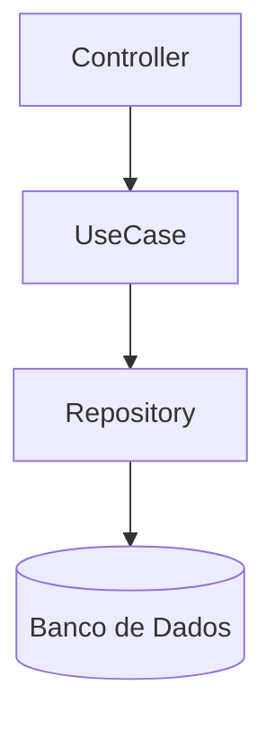

# C4 — Componentes

```mermaid
graph TD
  Controller --> UseCase
  UseCase --> Repository
  Repository --> DB[(Banco de Dados)]
```

Descreva os componentes internos de um container (controllers, use cases, repositories).
