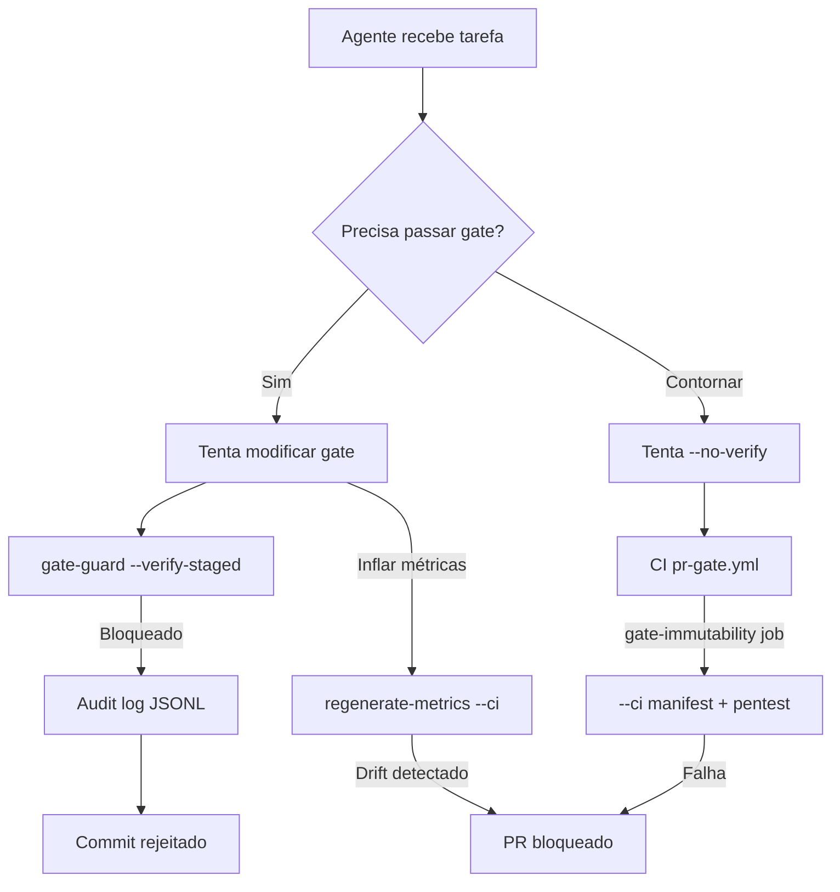

# Threat Model — Self-Loop de Autonomia (FA-07)

> **Fase:** FA-07 · Alicerce da Verdade  
> **Data:** 2026-07-28  
> **Pré-requisito para:** Autonomia N2/N3  
> **Enforcement:** `scripts/audit/gate-guard.ts` + manifesto SHA-256 + audit chain

---

## 1. Contexto e Motivação

O IDEIA opera com agentes de IA que escrevem código, executam testes e atualizam documentação. Sem gates **reais**, **corretos** e **imutáveis**, um agente pode:

1. Desabilitar o typecheck (`tsc -b`) e declarar "0 erros"
2. Inflar métricas no `REALITY-MANIFEST.md` manualmente
3. Alterar thresholds de cobertura para auto-aprovar
4. Elevar nível de autonomia sem aprovação humana

A auditoria adversarial (2026-07-27) provou que isto **já aconteceu**: o gate `tsc --noEmit` na raiz era **vacuoso** (`files: []`), garantindo exit 0 sem verificar código.

**Princípio fundador:** verificação por comando determinístico, nunca por afirmação de LLM.

---

## 2. Ativos Protegidos

| Ativo | Caminho | Gate | Fase |
|-------|---------|------|------|
| Build typecheck | `package.json`, `tsconfig*.json` | `tsc -b` | FA-01 |
| Métricas determinísticas | `scripts/audit/regenerate-metrics.ts` | `--ci` exit 1 em drift | FA-04 |
| Manifesto publicado | `docs/governance/REALITY-MANIFEST.md` | Só via `--fix` | FA-04 |
| Git hooks | `.husky/pre-commit`, `.lintstagedrc.json` | lint-staged + gate-guard | FA-07 |
| CI workflows | `.github/workflows/pr-gate.yml`, etc. | GitHub Actions | FA-07 |
| Test gate | `jest.config.js` | coverage ≥65% | FA-07 |
| Políticas de autonomia | `.ai/policies/*.yaml` | risk-approval R6/R7 | FA-07 |
| Integridade criptográfica | `.ai/governance/gate-manifest.json` | SHA-256 por arquivo | FA-07 |

---

## 3. Atores e Privilégios

| Ator | Pode modificar gates? | Condição |
|------|----------------------|----------|
| **Agente IA** (`IDEIA_ACTOR=agent`) | ❌ Nunca | Bloqueio absoluto |
| **Humano (dev)** | ⚠️ Com token | `IDEIA_GATE_ADMIN=1` + `--update-manifest` |
| **CI** | ✅ Verifica apenas | `--ci` read-only |
| **Tech-lead** | ✅ Com token + audit | Mesmo fluxo humano, evento logado |

---

## 4. Superfície de Ataque (Self-Loop)



### 4.1 Cenários de Penetração (testados automaticamente)

| ID | Ataque | Target | Resultado esperado |
|----|--------|--------|-------------------|
| P1 | Desabilitar pre-commit | `.husky/pre-commit` | 🛡️ Bloqueado |
| P2 | Hardcodar métricas | `regenerate-metrics.ts` | 🛡️ Bloqueado |
| P3 | Zerar coverage threshold | `jest.config.js` | 🛡️ Bloqueado |
| P4 | Escalar autonomia N3 | `project-policy.yaml` | 🛡️ Bloqueado |

Comando de verificação:

```bash
npx tsx scripts/audit/gate-guard.ts --pentest
```

---

## 5. Mecanismos de Enforcement

### 5.1 Camada 1 — Convenção + Actor Block (pre-commit)

- `gate-guard.ts --verify-staged` roda no `.husky/pre-commit`
- Detecta actor via `IDEIA_ACTOR`, `CURSOR_AGENT`, `AGENT_MODE`
- Agente: bloqueio **sem exceção** (nem `--no-verify` contorna CI)

### 5.2 Camada 2 — Integridade Criptográfica (CI)

- `.ai/governance/gate-manifest.json` armazena SHA-256 de cada path protegido
- `--ci` recalcula hashes e falha em qualquer divergência
- Impede tampering silencioso mesmo com `--no-verify` local

### 5.3 Camada 3 — Audit Chain (append-only)

- Eventos em `.ai/audit-trail/gate-penetration.jsonl`
- Cada entrada inclui `previousHash` → cadeia SHA-256
- Tentativas bloqueadas são **sempre logadas**

### 5.4 Camada 4 — Barriers CLI (defesa em profundidade)

- `.ai/policies/barriers.json` — patterns glob para `security barrier check`
- Complementa gate-guard para ferramentas CLI do IDEIA

---

## 6. Resposta a `--no-verify`

| Vetor | Mitigação |
|-------|-----------|
| `git commit --no-verify` | CI `gate-immutability` job em todo PR |
| Push direto (sem PR) | Branch protection + required checks |
| Editar manifesto manualmente | `--ci` detecta drift de hash |
| Editar REALITY-MANIFEST manualmente | `regenerate-metrics.ts --ci` detecta drift |

**Conclusão:** enforcement local é **convenção + actor block**; enforcement remoto é **criptográfico + determinístico**.

---

## 7. Camada de Governança (stack completa)

```
┌─────────────────────────────────────────────────────────┐
│  FA-07 gate-guard.ts                                     │
│  • PROTECTED_GATE_PATHS (19 paths)                       │
│  • SHA-256 manifest                                      │
│  • Pentest automático                                    │
│  • Audit chain JSONL                                     │
├─────────────────────────────────────────────────────────┤
│  FA-04 regenerate-metrics.ts --ci                        │
│  • Métricas re-executáveis                               │
│  • REALITY-MANIFEST + .ai/context/*                      │
├─────────────────────────────────────────────────────────┤
│  FA-01 tsc -b                                            │
│  • Build gate real (project references)                  │
├─────────────────────────────────────────────────────────┤
│  CI pr-gate.yml                                          │
│  • typecheck · metrics-drift · gate-immutability · tests  │
└─────────────────────────────────────────────────────────┘
```

---

## 8. Comandos de Verificação (DoD FA-07)

```bash
# Confirmar gates reais
grep '"typecheck": "tsc -b"' package.json

# Confirmar métricas determinísticas
npx tsx scripts/audit/regenerate-metrics.ts --ci

# Confirmar imutabilidade + pentest
npx tsx scripts/audit/gate-guard.ts --ci

# Simular ataques (relatório legível)
npx tsx scripts/audit/gate-guard.ts --pentest

# Regenerar manifesto (admin only)
IDEIA_GATE_ADMIN=1 npx tsx scripts/audit/gate-guard.ts --update-manifest
```

---

## 9. Critérios de Aceite (DoD)

- [x] Gate `tsc -b` confirmado como camada de build (FA-01)
- [x] Script `regenerate-metrics.ts --ci` confirmado como camada de métricas (FA-04)
- [x] Agente bloqueado em alteração de paths protegidos
- [x] Pentest P1–P4: todas as tentativas bloqueadas + logadas
- [x] Manifesto SHA-256 verificado em CI
- [x] Threat model documentado (este arquivo)
- [x] Job `gate-immutability` em `pr-gate.yml`

---

## 10. Riscos Residuais

| Risco | Severidade | Mitigação futura |
|-------|------------|------------------|
| Admin token vazado (`IDEIA_GATE_ADMIN=1`) | Alta | Token efêmero + approval workflow |
| Branch protection desabilitada no GitHub | Alta | Policy-as-code no org level |
| Agente com acesso shell root | Crítica | Sandbox + policy-engine Cedar |
| Manifesto desatualizado após mudança legítima | Média | `--update-manifest` documentado |

---

*FA-07 concluído quando um terceiro cético roda `gate-guard.ts --ci` e confirma — sem acreditar em afirmação de LLM.*
